## About Me

Sedang berkuliah di Universitas Negeri Padang jurusan Informatika. Tertarik Backend dan Mobile Development. Lagi belajar API, database, arsitektur aplikasi, dan flutter

 

## GitHub Stats

<table cellpadding="0" cellspacing="0">
  <tr>
    <td>
      
    </td>
    <td rowspan="2">
      
    </td>
  </tr>
  <tr>
    <td>
      
    </td>
  </tr>
</table>

 

---

  <picture>
    <source media="(prefers-color-scheme: dark)" srcset="https://raw.githubusercontent.com/Nyot-Nyot/Nyot-Nyot/output/github-contribution-grid-snake-dark.svg" />
    <source media="(prefers-color-scheme: light)" srcset="https://raw.githubusercontent.com/Nyot-Nyot/Nyot-Nyot/output/github-contribution-grid-snake.svg" />
    
  </picture>

<!--  -->
